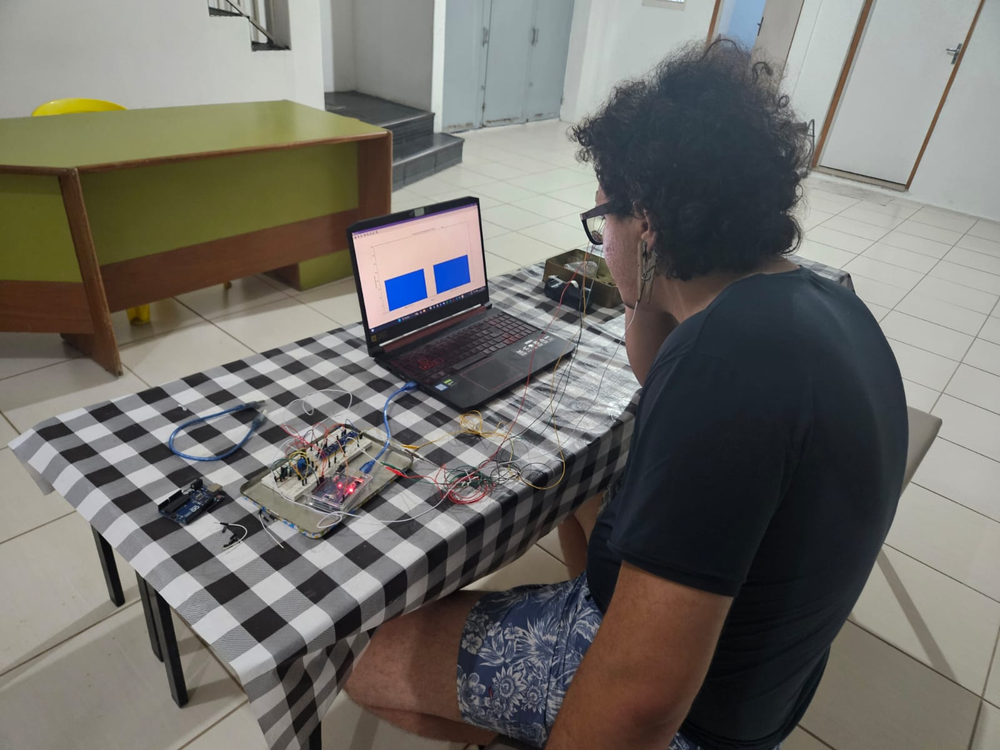

# EEG with Arduino - version 1.0
Home made EEG utilizing basic electronic components and an Arduino.

## Introduction
This project aims to developing an eletroencefalogram (EEG) utilizing simple eletronic and microeletronic components. The longer I get through my engineering course, the more I see how important is the "Cheapening Engineering" for the science development. So many projects that we found out so amazing and greatefull just takes really long or can't go any further because lack of investiment. Also, sometimes, several studies and tests does not require a very precise equipment, people usually look first for either prototypes or simpler versions of the device in question. Here, I'm trying to bring an alternative for those who looks to make some basic reseach in the area of brain computer interface (BCI), and also you can take that as an inspiration to build your own EEG or similar and even look for possible upgrades, fixes and so on. 

## How does the circuit works

## Building the device

## Analysis

## Conclusion

## Extra
If you either want to suggest changes, discuss or anything else, feel free to contact me: [LinkedIn](https://www.linkedin.com/in/matheus-capelin-a398a9289/), or just use github issue if you prefer.

## Licence
This project is licensed under the MIT license - See [LICENSE](LICENSE) for more details.
